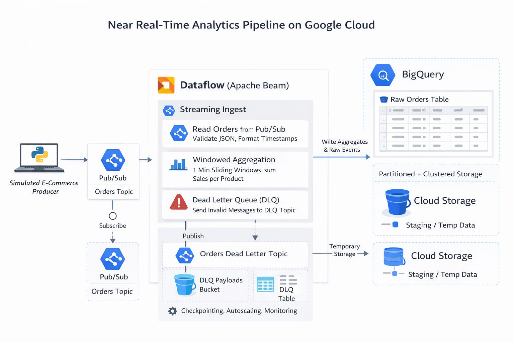

#  Realtime Ingestion Simulator


Lightweight simulator and streaming pipeline demonstrating a near real-time ingestion flow using Pub/Sub → Dataflow (Apache Beam) → BigQuery.

This repository provides a minimal example for generating events, validating and processing them with Apache Beam, and writing results to BigQuery and a dead-letter Pub/Sub topic.

---

## Architecture




---

## Repository layout

realtime_ingestion_sim/

- `producer.py`  — publishes simulated order events to a Pub/Sub topic
- `pipeline.py`  — Apache Beam streaming pipeline (reads Pub/Sub, writes BigQuery & DLQ)
- `Readme.md`    — existing project README
- `README_GITHUB.md` — this GitHub-ready README

---

## Quickstart (local / small-scale)

1. Create and activate a virtual environment (recommended):

```bash
python -m venv .venv
source .venv/bin/activate
```

2. Install dependencies:

```bash
pip install -r requirements.txt
```

If you don't have `requirements.txt`, you can install the primary dependencies directly:

```bash
pip install google-cloud-pubsub apache-beam[gcp]
```

3. Configure environment variables (replace placeholders):

```bash
export PROJECT=YOUR_PROJECT_ID
export PUBSUB_TOPIC=orders-topic
export PUBSUB_SUBSCRIPTION=projects/${PROJECT}/subscriptions/orders-sub
export TEMP_BUCKET=YOUR_BUCKET_NAME
export REGION=us-central1
```

4. Authenticate with Google Cloud for local testing:

```bash
gcloud auth application-default login
```

5. Run the event producer (publishes one event per second):

```bash
python producer.py
```

6. Deploy the streaming pipeline to Dataflow (or run locally with `DirectRunner`):

```bash
python pipeline.py
```

Notes:

- `producer.py` and `pipeline.py` include placeholder defaults for `PROJECT` and `TEMP_BUCKET`. Replace `YOUR_PROJECT_ID` and `YOUR_BUCKET_NAME` with your actual GCP project id and bucket name, or set the corresponding environment variables before running.
- To run the Beam pipeline locally for testing, change the `runner` in `PipelineOptions` inside `pipeline.py` to `DirectRunner`.

---

## GCP setup (high level)

- Enable required APIs: Dataflow, Pub/Sub, BigQuery, Cloud Storage.
- Create Pub/Sub topic and subscription: `orders-topic`, `orders-sub` (manual subscription recommended).
- Create BigQuery dataset `streaming_demo` and tables:
  - `raw_orders` partitioned by DATE(event_time) and clustered by `product_id`.
  - `product_sales_1min` for 1-minute aggregates.
- Create a regional GCS bucket for Dataflow staging/temp matching your `REGION`.
- Ensure the Dataflow service account has `storage.objectAdmin`, `dataflow.worker`, `bigquery.dataEditor`, and `pubsub.subscriber` roles.

### Example BigQuery DDL

Use the `bq` CLI or the console to create the raw table:

```sql
CREATE TABLE streaming_demo.raw_orders (
  order_id STRING,
  user_id STRING,
  product_id STRING,
  amount FLOAT64,
  event_time TIMESTAMP
)
PARTITION BY DATE(event_time)
CLUSTER BY product_id;
```

---

## Dead-letter handling

- Malformed or invalid messages are emitted to a dead-letter topic configured by `DLQ_TOPIC` in `pipeline.py` (default: `projects/${PROJECT}/topics/orders-dead-letter`).

---

## Schema

- Raw orders (`raw_orders`): `order_id:STRING,user_id:STRING,product_id:STRING,amount:FLOAT,event_time:TIMESTAMP`
- Aggregates (`product_sales_1min`): `product_id:STRING,window_start:TIMESTAMP,total_sales:FLOAT,order_count:INTEGER`

---

## Development & testing

- To test transforms locally, set `runner` to `DirectRunner` in `pipeline.py` and provide a local Pub/Sub emulator or replace `ReadFromPubSub` with test PCollections.
- Consider adding a `requirements.txt` and a small integration test that runs the pipeline with `DirectRunner`.

---

## Contributing

Contributions are welcome. Please open issues or PRs for bugs and enhancements.

---

